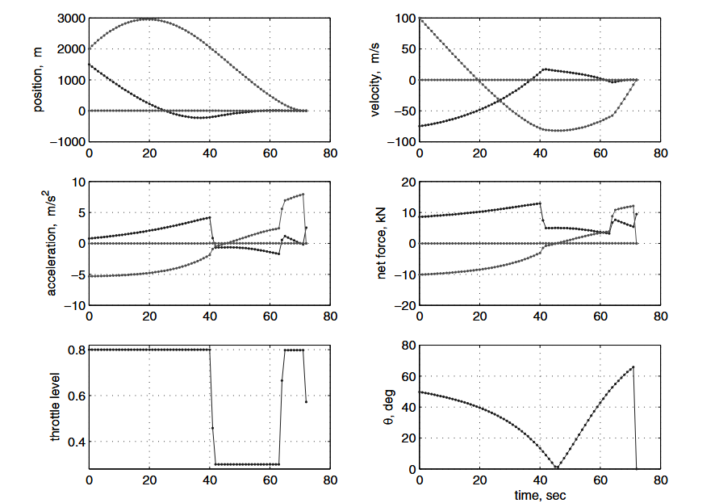
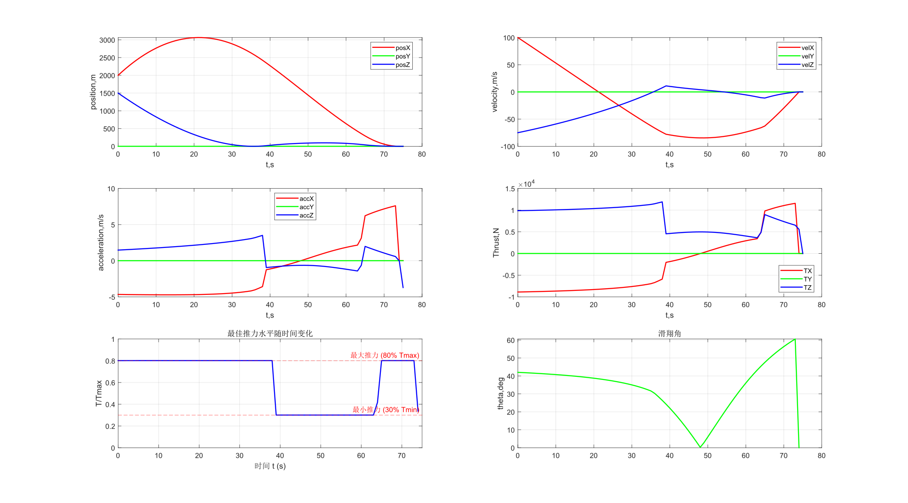
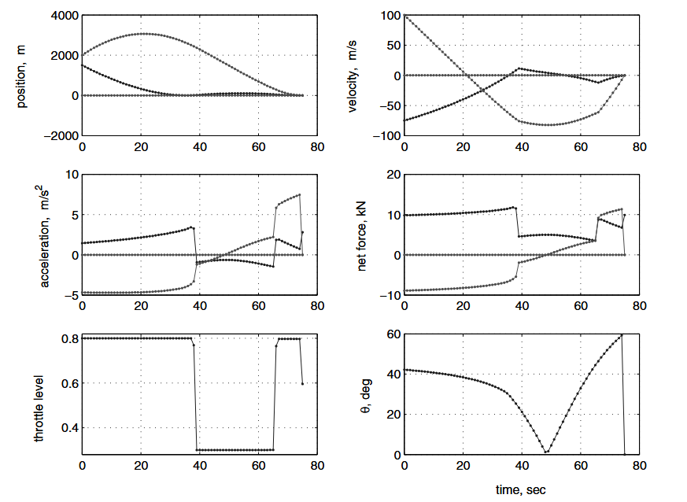
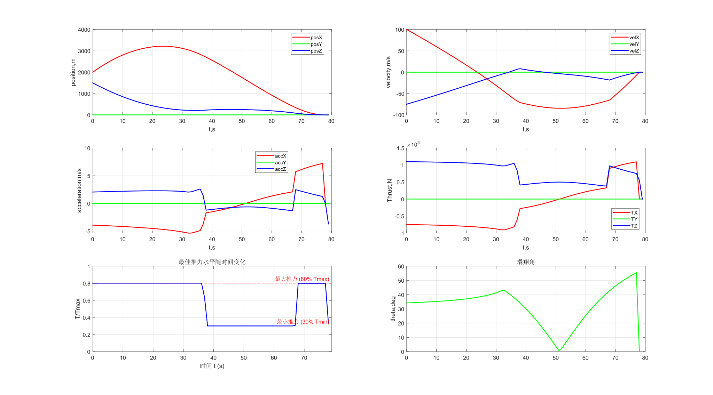
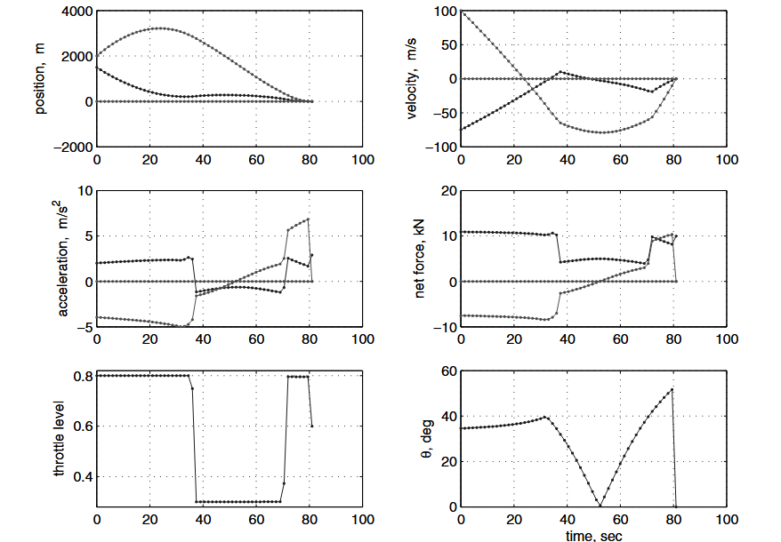
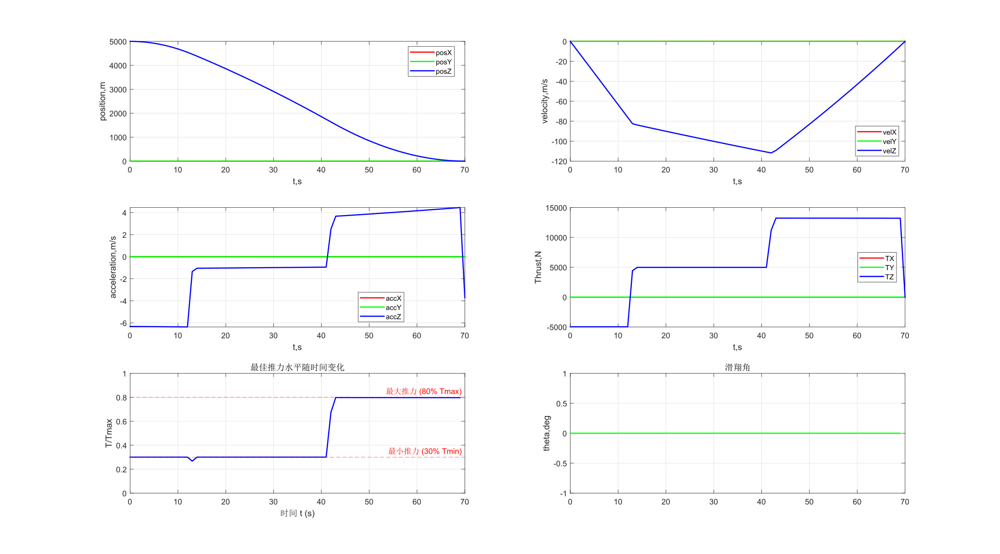
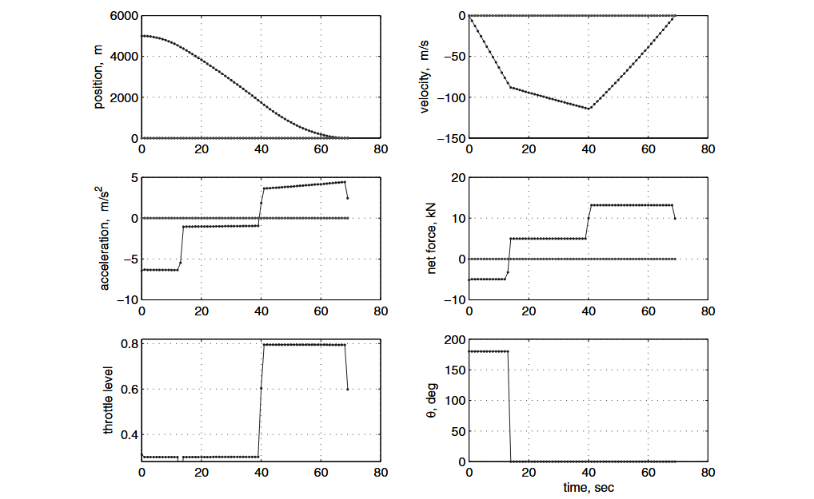
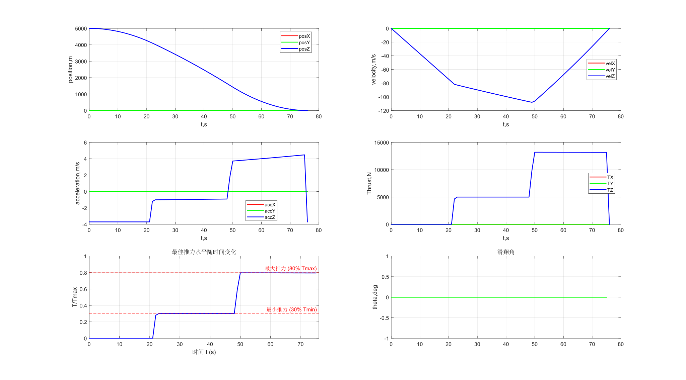
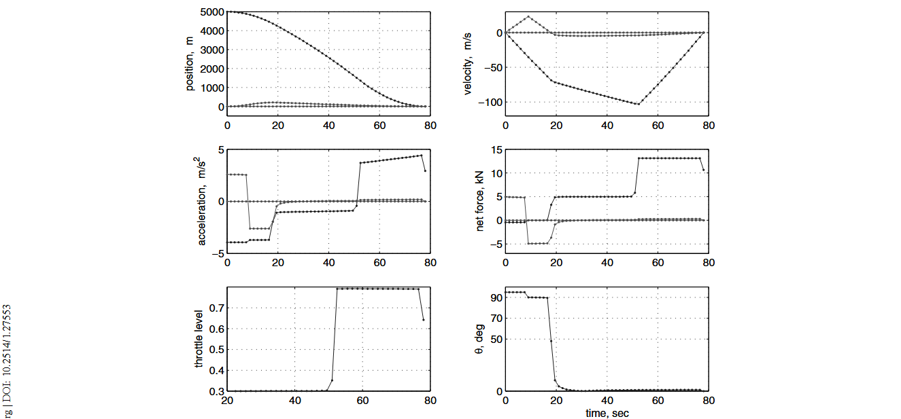

# 论文复现结果
## 实验一：problem4 without no-subsurface flight constraint.
初始条件：
$r=[1.5,0,2]^T$km,
$\dot{r}_0=[-75,0,100]^T$m/s

仿真结果：
|  |
|:--------------------------------------------------------------:|
|*fig1.1 fuel usage=390.61kg tf=73s*|

论文数据截图：
|  |
|:--------------------------------------------------------------:|
|*fig1.2 fuel usage=387.9kg tf=72s*|

- 复刻结果与论文基本相同，推力曲线都呈现Bang-Bang曲线，速度，加速度和位置变化趋势基本一致
- 不足：
    1. 论文中，最优燃料消耗为387.9kg，但是我的最优结果是390.61kg
    2. 论文中，最佳tf=72s，但是我的仿真结果为tf=73s
    3. 论文中，t=tf时，推力水平在58%左右，但是我的结果中，t=tf时推力水平为30%
## 实验二：problem4 with no-subsurface flight constraint.
初始条件：
$r=[1.5,0,2]^T$km,
$\dot{r}_0=[-75,0,100]^T$m/s

增加约束：
$r(1)>=0$

仿真结果：
|  |
|:--------------------------------------------------------------:|
|*fig2.1 fuel usage=393.26kg tf=75s*|

论文数据截图：
|  |
|:--------------------------------------------------------------:|
|*fig2.2 fuel usage=390.4kg tf=75s*|

- 不足：
    1. 论文中，最优燃料消耗为390.4kg，但是我的最优结果是393.26kg
    2. 论文中，t=tf时，推力水平在60%左右，但是我的结果中，t=tf时推力水平为33%
## 实验三：problem4 without glide slope constraint.
初始条件：
$r=[1.5,0,2]^T$km,
$\dot{r}_0=[-75,0,100]^T$m/s

增加约束：
$r(1)>=0$
${\theta}_{alt}<=86deg$

仿真结果：
|  |
|:--------------------------------------------------------------:|
|*fig3.1 fuel usage=400.95kg tf=81s*|

论文数据截图：
|  |
|:--------------------------------------------------------------:|
|*fig3.2 fuel usage=399.5kg tf=81s*|

- 不足：
    1. 论文中，最优燃料消耗为399.5kg，但是我的最优结果是400.95kg，已经超过了fuel=400kg的预设
    2. 论文中，t=tf时，推力水平在60%左右，但是我的结果中，t=tf时推力水平仍为33%
## 实验四：problem4 without thrust pointing constraint.
初始条件：
$r=[5,0,0]^T$km,
$\dot{r}_0=[0,0,0]^T$m/s

增加约束：
$r(1)>=0$
${\theta}_{alt}<=86deg$

仿真结果：
| |
|:--------------------------------------------------------------:|
|*fig4.1 fuel usage=293.19kg tf=70s*|

论文数据截图：
|  |
|:--------------------------------------------------------------:|
|*fig4.2 fuel usage=293.6kg tf=69s*|

- 不足：
    1. 论文中，最优燃料消耗为293.6kg，但是我的最优结果是293.19kg
    2. 论文中，tf=69s,但是我的仿真结果为最优tf=70s
>疑问：无论是文献还是我的仿真，都出现了在10-20s曲线内的一个异常值点，超出了推力30%最低限制，不太清楚背后的原因是什么

## 实验五：problem4 with thrust pointing constraint.
初始条件：
$r=[5,0,0]^T$km,
$\dot{r}_0=[20,0,0]^T$m/s

增加约束：
$r(1)>=0$
${\theta}_{alt}<=86deg$
$v^Tu(t)>=\gamma*\sigma(t)$,$\gamma=0$,$v^T=[1,0,0]$

仿真结果：
| |
|:--------------------------------------------------------------:|
|*fig5.1 fuel usage=302.98kg tf=76s*|

论文数据截图：
|  |
|:--------------------------------------------------------------:|
|*fig5.2 fuel usage=303kg tf=78s*|

- 不足：
  1. 论文给出的数据中存在一个水平的推力变化，没能理解这背后的原因，我的结果也没有这个变化，这也直接导致了滑翔角的图像完全不同.
  2. 我的仿真结果在0-20s左右的时间内的推力是0，与论文差别很大，目前排查的结果是$\sigma(t)$d是正常的，原因来自求解器给出的$u(t)$在0-20s的值为0，但是论文给出的公式约束是$||u(t)||<=\sigma(t)$,理论上这是允许发生的。

## 总结思考
### 总结思考
- 我的仿真结果在实验一到四都大致相同，小的差别很可能来自于末端推力约束处理问题，将在下一步解决这个问题；实验五结果完全不一致，我对VI部分`Trajectory Optimization with Thrust Pointing Constraints`半知半解，对论文的结果有以下疑问：
>论文中给的初始条件为$r=[5,0,0]^T$km,$\dot{r}_0=[20,0,0]^T$m/s，这应该是不需要水平方向上的推力纠偏的，但是论文的结果却有水平方向上的分量，这和$min objective$是矛盾的
- 仿真的速度很大程度上取决于N的范围区间，优化求解时间的一个方法是找到最优解存在的最小区间，或者动态调整解的区间
- 这篇论文的一个预置条件时发动机一旦开机就不能中途关闭，那么点火时机的确定就很重要，这篇论文没有考虑
- 仿真的速度还取决于`dt`的大小，dt越小，求解的结果就越优，同时计算开销也是成倍增长，因此dt的大小很重要。
- 这篇论文是loseless优化的开篇之作，后续还有刚体6自由度模型和姿态约束等问题需要考虑

