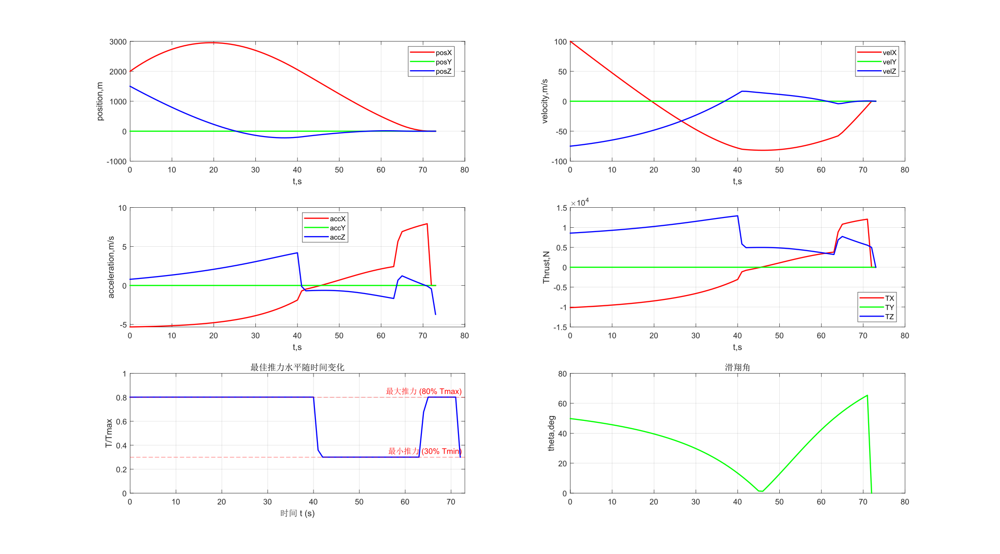

# 论文复现结果
## 实验一：problem4 without no-subsurface flight constraint.
初始条件：
$r=[1.5,0,2]^T$km,
$\dot{r}_0=[-75,0,100]^T$m/s
仿真结果：
|  |
|:--:|
| *fig.1  fuel usage=390.61kg* |

- 复刻结果与论文基本相同，推力曲线都呈现Bang-Bang曲线，速度，加速度和位置变化趋势基本一致
- 不足：
    1. 论文中，最优燃料消耗为387.9kg，但是我的最优结果是390.61kg
    2. 论文中，最佳tf=72s，但是我的仿真结果为tf=73s
    3. 论文中，t=tf时，推力水平在58%左右，但是我的结果中，t=tf时推力水平为30%
## 实验二：problem4 with no-subsurface flight constraint.
初始条件：
$r=[1.5,0,2]^T$km,
$\dot{r}_0=[-75,0,100]^T$m/s

增加约束：
$r(1)>=0$

仿真结果：
||
|:--:|
| *fig.2  fuel usage=393.26kg* |
- 不足：
    1. 论文中，最优燃料消耗为390.4kg，但是我的最优结果是393.26kg
    2. 论文中，t=tf时，推力水平在60%左右，但是我的结果中，t=tf时推力水平为33%
## 实验三：problem4 without glide slope constraint.
初始条件：
$r=[1.5,0,2]^T$km,
$\dot{r}_0=[-75,0,100]^T$m/s

增加约束：
$r(1)>=0$
${\theta}_{alt}<=86deg$

仿真结果：
||
|:--:|
| *fig.3  fuel usage=400.95kg* |
- 不足：
    1. 论文中，最优燃料消耗为399.5kg，但是我的最优结果是400.95kg，已经超过了fuel=400kg的预设
    2. 论文中，t=tf时，推力水平在60%左右，但是我的结果中，t=tf时推力水平仍为33%
## 实验四：problem4 without thrust pointing constraint.
初始条件：
$r=[5,0,0]^T$km,
$\dot{r}_0=[0,0,0]^T$m/s

增加约束：
$r(1)>=0$
${\theta}_{alt}<=86deg$
$v^Tu(t)>=\gamma*\sigma(t)$,$\gamma=0$,$v^T=[1,0,0]$

仿真结果：
||
|:--:|
| *fig.4  fuel usage=293.19kg* |
- 不足：
    1. 论文中，最优燃料消耗为293.6kg，但是我的最优结果是293.19kg
    2. 论文中，tf=69s,但是我的仿真结果为最优tf=70s
>疑问：无论是文献还是我的仿真，都出现了在10-20s曲线内的一个异常值点，超出了推力30%最低限制，不太清楚背后的原因是什么

## 实验四：problem4 with thrust pointing constraint.

