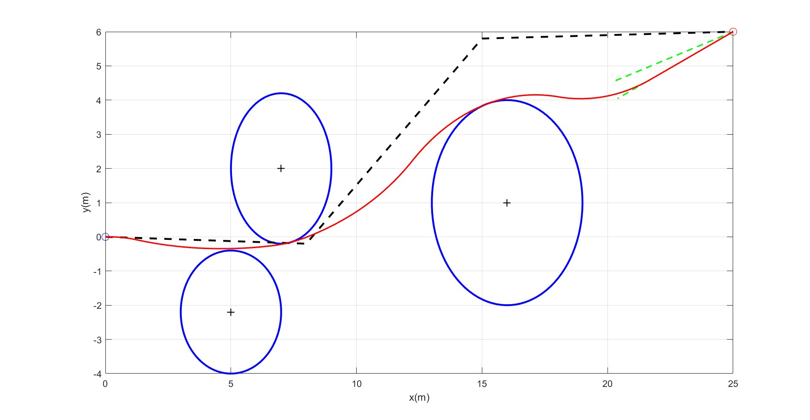
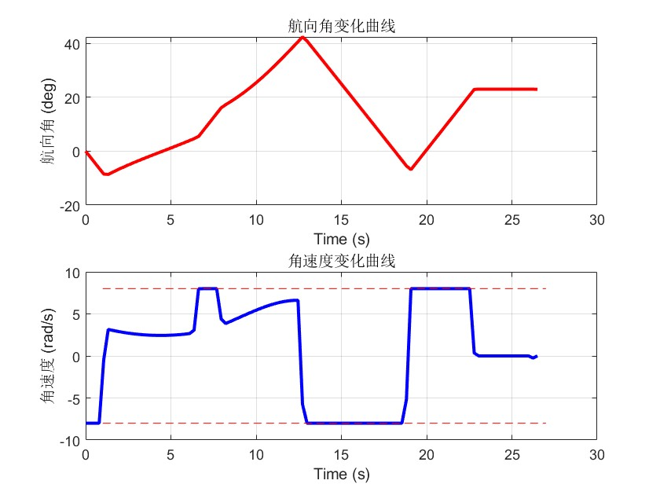
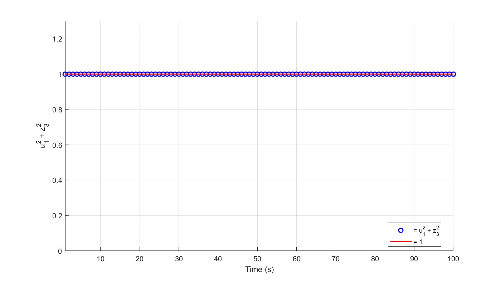

# 无人机轨迹优化论文复现结果
## 实验A:无人机避障

### 优化轨迹曲线：
|  |
|:--------------------------------------------------------------:|
|*fig.1 Flight trajectory of a UAV with multiple avoidance zones*|
### 航向角和角速度数据：
|  |
|:--------------------------------------------------------------:|
|*fig.2 Heading angle and angular velocity histories*|
### 凸松弛结果验证：
|  |
|:--------------------------------------------------------------:|
|*fig.3 Status of the relaxed constraint*|

### 迭代历史：
| k | $max\vert\Delta x_i\vert(m)$ | $max\vert\Delta y_i\vert(m)$ | computation time(ms)|
|:-:|:--------------------:|:--------------------:|:-------------------:|
| 1 | 0.355628 | 1.568546 | 11.1 |
| 2 | 0.191471 | 0.342022 | 10.6 |
| 3 | 0.009585 | 0.029001 | 9.8 |
| 4 | 0.000054 | 0.000157 | 9.7 |

## 总结
1. 复现结果体现了论文的核心要点：
  - `快速收敛`：经过三次迭代就达到了 $\epsilon$ 停止条件
  - `松弛条件有效`：即使混合约束经过了凸松弛，但是fig.3表明这样做是有效的
  - `Assumption1-4假设成立`：

- [x] **Assumption1**: 根据fig.2,heading angle均在$-\frac{\pi}{2}~\frac{\pi}{2}$范围内，假设1成立
- [x] **Assumption2** : 由fig.2可知控制约束 $|u2/u1|<= w_{max}$ 在 [6.6,7.7] 和 [13,18.6] 时间段内是有效的(达到边界值)，但是由fig.4可知此时的$n^{nc}$约束是不活跃的(没达到边界值)；同样的，在最后3s时间段内，由fig.2可知控制约束 $|u2/u1|<= w_{max}$是不活跃的，由fig.5可知，这时候的$n^c$约束是有效的

|  |
|:--------------------------------------------------------------:|
|*fig.3 Status of the relaxed constraint*|