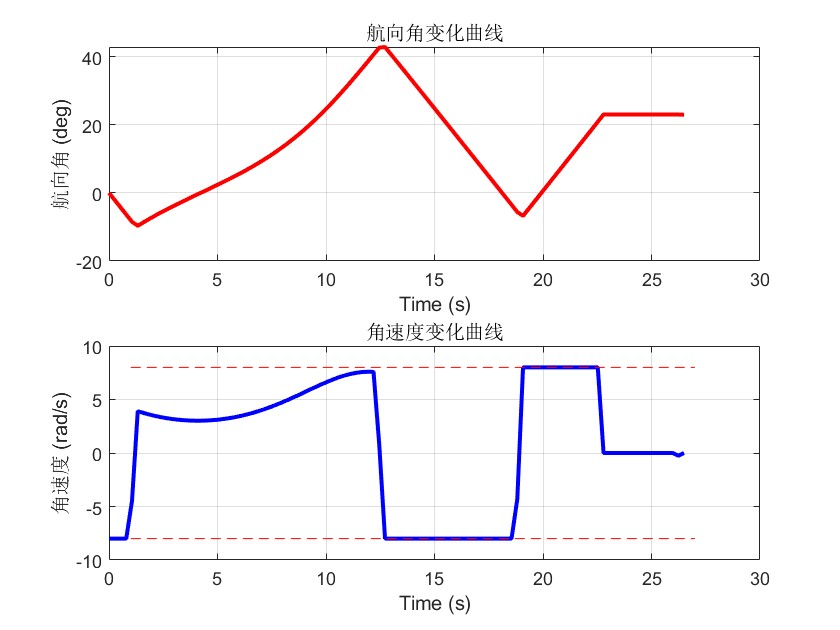

# 无人机轨迹优化论文复现结果
## 实验A:无人机避障

### 优化轨迹曲线：
|  |
|:--------------------------------------------------------------:|
|*fig.1 Flight trajectory of a UAV with multiple avoidance zones*|
### 航向角和角速度数据：
|  |
|:--------------------------------------------------------------:|
|*fig.2 Heading angle and angular velocity histories*|
### 凸松弛结果验证：
|  |
|:--------------------------------------------------------------:|
|*fig.3 Status of the relaxed constraint*|

### 迭代历史：
| k | $max\vert\Delta x_i\vert(m)$ | $max\vert\Delta y_i\vert(m)$ | computation time(ms)|
|:-:|:--------------------:|:--------------------:|:-------------------:|
| 1 | 0.441510 | 1.489213 | 10.4 |
| 2 | 0.142055 | 0.447953 | 8.1 |
| 3 | 0.003463 | 0.020342 | 9.2 |
| 4 | 0.000044 | 0.000131 | 9.1 |

###  总结与思考
#### 1. 复现结果体现了论文的核心贡献：
  - `快速收敛性`：经过三次迭代就达到了 $\epsilon$ 停止条件
  - `凸松弛有效性`：即使混合约束经过了凸松弛，但是fig.3表明这样做是有效的
  - `假设基本成立`：

- [x] **Assumption1**: 根据fig.2,heading angle均在$-\frac{\pi}{2}~\frac{\pi}{2}$范围内，假设1成立
- [x] **Assumption2** : 
- 在[6.6,7.7]时间段内，控制约束处于激活状态（角速度达边界），而避障约束未激活（fig.4），符合假设
- 在[13,18.6]时间段内，控制约束与第三个障碍物的状态约束同时激活（fig.5），违反了 Assumption 2；

|  |
|:--------------------------------------------------------------:|
|*fig.4 Assumption2:zone1&2*|

|  |
|:--------------------------------------------------------------:|
|*fig.5 Assumption2:zone3*|

- 在最后3秒内，控制约束未激活，而终端锥形约束处于激活状态（fig.7），符合假设

|  |
|:--------------------------------------------------------------:|
|*fig.7 Assumption2:approach cone*|

- [x] **Assumption3&4** : 由fig.1可知，所有点都在直线y=1上方,因此$\frac{dy}{dt}=2(y+1)$恒不为0，假设成立
  
#### 2. 仿真数据与原论文存在较大差别:
1. 原论文中角速度呈现明显的 Bang-Bang 控制特性，而本次仿真前半段未出现该特征(fig.1)，推测是由于障碍物位置、尺寸或初始轨迹设定不同所致

2. 尽管在第三个障碍物处违反了 Assumption 2，算法仍成功收敛至可行解，表明：
- 该假设为充分非必要条件，实践中允许一定程度的违反；
- 算法具有较强的鲁棒性，能在非理想条件下保持稳定收敛。

3. 原论文中无人机进入approach cone的时候选择贴合theta=17deg的边线，但是我的仿真结果显示无人机会贴合theta=23deg的边线,我的分析是可能受到目标函数的影响，贴合最下面的直线可能是为了降低 $\int f(y)dt$，也不排除是最后一个障碍物的位置影响
   
## 实验B:汽车换道
> k3=1000在我的代码中的结果和论文差别很大，存在明显超调行为；但是经过调参发现k3=1时复现的结果和论文非常接近
>下面给出k3=1000和k3=1的对比:
### k3=1000时：
#### 优化轨迹曲线和凸松弛结果验证:
|  |
|:--------------------------------------------------------------:|
|*fig.8 The lane-change trajectories & The status of the relaxed constraint*|
#### 航向角和角速度数据：
|  |
|:--------------------------------------------------------------:|
|*fig.9 Heading angle and angular velocity histories*|
#### 迭代历史:
##### with obstacle avoidance:
| k | $max\vert\Delta x_i\vert(m)$ | $max\vert\Delta y_i\vert(m)$ | computation time(ms)|
|:-:|:--------------------:|:--------------------:|:-------------------:|
| 1 | 2.913980 | 2.296826 | 8.8 |
| 2 | 0.060166 | 0.293878 | 8.9 |
| 3 | 0.004246 | 0.015686 | 8.5 |
| 4 | 0.243720 | 0.006444 | 7.1 |
| 5 | 0.200770 | 0.003820 | 7.6 |

##### without obstacle avoidance:
| k | $max\vert\Delta x_i\vert(m)$ | $max\vert\Delta y_i\vert(m)$ | computation time(ms)|
|:-:|:--------------------:|:--------------------:|:-------------------:|
| 1 | 2.523835 | 2.296825 | 5.3 |
| 2 | 0        | 0        | 5.4 |
| 3 | 0        | 0        | 5.3 |
| 4 | 0        | 0        | 5.6 |

### k3=1时:
#### 优化轨迹曲线和凸松弛结果验证：
|  |
|:--------------------------------------------------------------:|
|*fig.10 The lane-change trajectories & The status of the relaxed constraint*|

#### 航向角和角速度数据：
|  |
|:--------------------------------------------------------------:|
|*fig.11 Heading angle and angular velocity histories*|

#### 迭代历史:
##### with obstacle avoidance:
| k | $max\vert\Delta x_i\vert(m)$ | $max\vert\Delta y_i\vert(m)$ | computation time(ms)|
|:-:|:--------------------:|:--------------------:|:-------------------:|
| 1 | 2.831746 | 2.200651 | 6.3 |
| 2 | 0.059689 | 0.295450 | 6.4 |
| 3 | 0.003720 | 0.015933 | 6.5 |
| 4 | 0.000035 | 0.000206 | 6.4 |

##### without obstacle avoidance:
| k | $max\vert\Delta x_i\vert(m)$ | $max\vert\Delta y_i\vert(m)$ | computation time(ms)|
|:-:|:--------------------:|:--------------------:|:-------------------:|
| 1 | 2.471819 | 2.200651 | 5.1 |
| 2 | 0        | 0        | 4.7 |
| 3 | 0        | 0        | 4.9 |
| 4 | 0        | 0        | 5.1 |

### 总结与思考
- 尽管k3=1复现结果与论文给出的数据相同，但是求解器在无障碍物问题下仍然还是报告了`problem=4:Numerical problem`,这说明解仍然不是最优的；

- k3=1000时出现明显超调，推测是由于物理约束限制：即使以最大角速度转向，也无法直接完成换道。因此求解器找到一种先反向预转向、再以最大角速度转向的策略，以达成可行解。该行为随k3增大而加剧，反映出目标函数权重对轨迹形态的显著影响。

