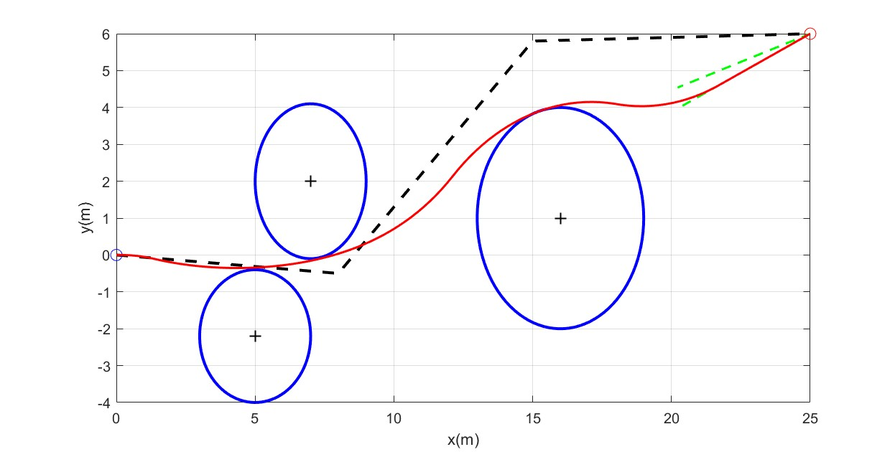
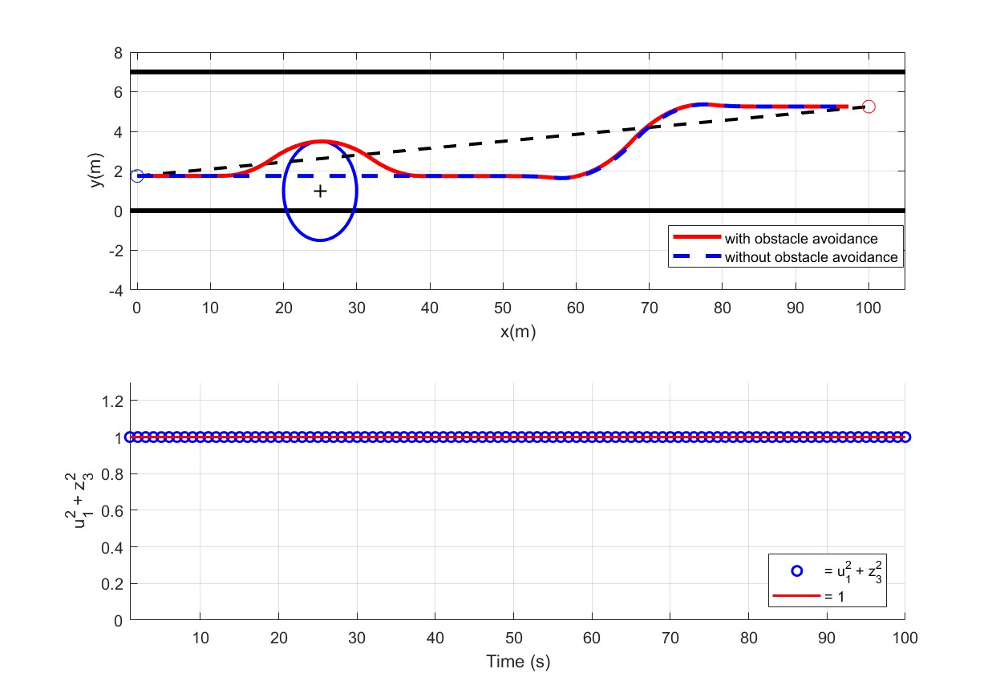

# 无人机轨迹优化论文复现结果
## 实验A:无人机避障

### 优化轨迹曲线：
|  |
|:--------------------------------------------------------------:|
|*fig.1 Flight trajectory of a UAV with multiple avoidance zones*|
### 航向角和角速度数据：
|  |
|:--------------------------------------------------------------:|
|*fig.2 Heading angle and angular velocity histories*|
### 凸松弛结果验证：
|  |
|:--------------------------------------------------------------:|
|*fig.3 Status of the relaxed constraint*|

### 迭代历史：
| k | $max\vert\Delta x_i\vert(m)$ | $max\vert\Delta y_i\vert(m)$ | computation time(ms)|
|:-:|:--------------------:|:--------------------:|:-------------------:|
| 1 | 0.441510 | 1.489213 | 10.4 |
| 2 | 0.142055 | 0.447953 | 8.1 |
| 3 | 0.003463 | 0.020342 | 9.2 |
| 4 | 0.000044 | 0.000131 | 9.1 |

## 总结与思考
### 1. 复现结果体现了论文的核心要点：
  - `快速收敛`：经过三次迭代就达到了 $\epsilon$ 停止条件
  - `松弛条件有效`：即使混合约束经过了凸松弛，但是fig.3表明这样做是有效的
  - `Assumption1-4假设基本成立`：

- [x] **Assumption1**: 根据fig.2,heading angle均在$-\frac{\pi}{2}~\frac{\pi}{2}$范围内，假设1成立
- [x] **Assumption2** : 
- 在[6.6,7.7]时间段内，由fig.2可知控制约束 $|u2/u1|<= w_{max}$ 时间段内是有效的(达到边界值)，但是由fig.4可知此时的$n^{nc}$约束是不活跃的(没达到边界值)；
- 在[13,18.6]时间段内，存在违反假设情况，由fig.2可知控制约束 $|u2/u1|<= w_{max}$ 时间段内是有效的(达到边界值)，但是由fig.5可知此时的$n^{nc}$约束是活跃的(没达到边界值)；

|  |
|:--------------------------------------------------------------:|
|*fig.4 Assumption2*|

|  |
|:--------------------------------------------------------------:|
|*fig.5 Assumption2*|

- 在最后3s时间段内，由fig.2可知控制约束 $|u2/u1|<= w_{max}$是不活跃的，由fig.7可知，这时候的$n^c$约束是有效

|  |
|:--------------------------------------------------------------:|
|*fig.7 Assumption2*|

- [x] **Assumption3&4** : 由fig.1可知，所有点都在y=1上,因此$\frac{dy}{dt}=2(y+1)$恒不为0，假设成立
  
### 2. 仿真数据与原论文存在较大差别
1. 原论文中Angular velocity呈现出明显的Bang-Bang控制特性，但是fig.1的前半段数据没有这个特点，这可能是障碍物的位置和大小数据，与初始轨迹的选择与原论文不同导致

2. 原论文中无人机进入approach cone的时候选择贴合theta=17deg的边线，但是我的仿真结果显示无人机会贴合theta=23deg的边线,我的分析是可能受到目标函数的影响，贴合最下面的直线可能是为了降低 $\int f(y)dt$，也不排除是最后一个障碍物的位置影响
   
## 实验B:汽车换道
> k3=1000在我的代码中的结果和论文差别很大，存在明显超调行为，而且有障碍的情况没有解；但是经过反复调整，发现k3=1时复现的结果和论文非常接近，有障碍时仍然有解；因此下面将给出两个k3跑出的不同结果，但是仅供参考
### k3=1000时：

### k1=1时；
|  |
|:--------------------------------------------------------------:|
|*fig.8 The lane-change trajectories*|

|  |
|:--------------------------------------------------------------:|
|*fig.8 Heading angle and angular velocity histories*|