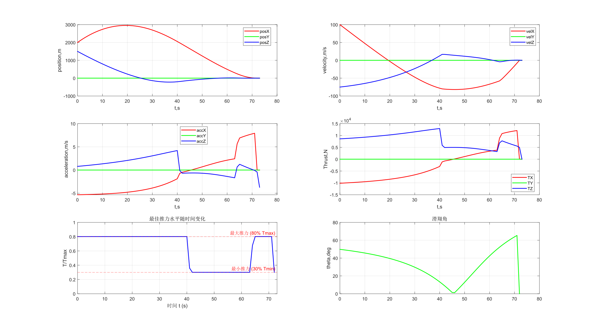
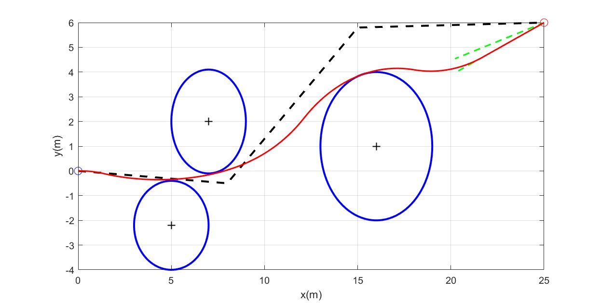
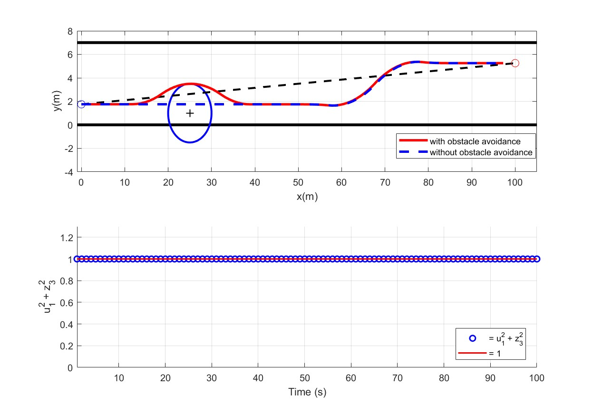

# LosslessConvex:无损凸化方法
> 使用matlab语言复现使用无损凸化方法的论文
> Email:3036446522@qq.com

|项目|描述|
|:-:|:-:|
|Marsland|为火箭等航天器的动力段下降过程规划轨迹实现精确着陆，同时使得燃料消耗最优|
|TrajectoryPlanning|为无人机轨迹优化提供一个全新的方法，分为两个部分`Avoidance`实现无人机避障，`LaneChange`实现无人车辆换道|

## Marsland:基于无损凸化的火星着陆轨迹优化
>文章来源：[Convex Programming Approach to Powered Descent Guidance for Mars Landing](https://arc.aiaa.org/doi/10.2514/1.27553)

## TrajectoryPlanning:基于无损凸化的无人机轨迹优化
>文章来源：[Convergence-Guaranteed Trajectory Planning for a Class of Nonlinear Systems With Nonconvex State Constraints](https://ieeexplore.ieee.org/document/9627774/)
### AvoidanceZone:

### LaneChange:

