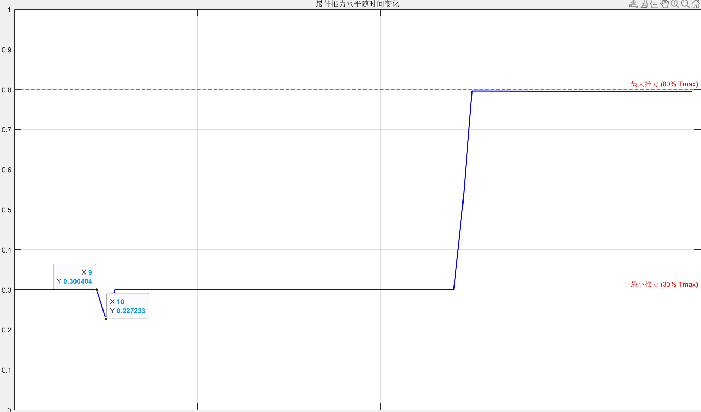

## LosslessConvex无损凸化
### 2025/9/17
复现了Acikmese这篇论文的第一个实验，文章来源：[Convex Programming Approach to Powered Descent Guidance for Mars Landing](https://arc.aiaa.org/doi/10.2514/1.27553)
- 能实现：对发动机深度节流的非凸性进行无损凸化
- 不足：未引入滑翔角约束和高度>0的约束
### 2025/9/18
Todolist:
- 修改results存储变量（速度，位置）减少不必要的计算
- 增加一个findbest函数，将线性搜索代码分离出来
- 修改一下时序，控制段，时间点的关系有点混乱
### 2025/9/18
Todolist:
- 增加一个推力方向约束
Record:
- 论文使用的dt=1s，但是发现如果将dt缩小的话可以将消耗燃料进一步优化，但是优化有限，从1s->0.5s,计算开销增长了一倍，但是燃料只优化了1kg，这说明存在一个最佳dt能够很好的平衡计算开销和燃料优化
- 在相同约束条件下，实验二：z>0优化结果fuel始终比论文大了3kg，还没找到原因，或许是求解器的问题?
- 求解问题任然需要很多时间，我觉得这已经不是缩小N范围能解决的了，我怀疑是三个原因：1.求解器本身2.包调用和解释器耗费时间，直接用c可能好点3.我的算法可以进一步优化;目前我能做的只有第三个
- 更新plotData绘图函数
### 2025/9/19
Todolist:
- 试图去修改时序达到论文的效果，反而更加背离了
### 2025/9/20
problem:
- 时序逻辑改了好像不如不改
- 怎么在实验三中初始条件设置为r0=[5,0,0],$\dot{r}_0$=[0,0,0]后出现了一个迷惑行为，祖师爷的论文也有这个问题，但是没有解释
