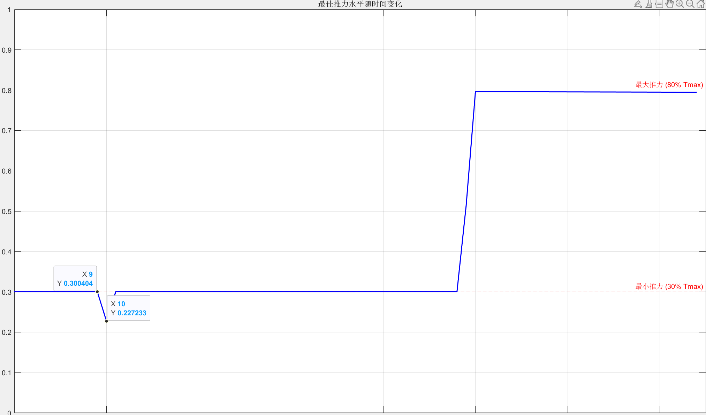

## LosslessConvex无损凸化
### 2025/9/17
复现了Acikmese这篇论文的第一个实验，文章来源：[Convex Programming Approach to Powered Descent Guidance for Mars Landing](https://arc.aiaa.org/doi/10.2514/1.27553)
- 能实现：对发动机深度节流的非凸性进行无损凸化
- 不足：未引入滑翔角约束和高度>0的约束
### 2025/9/18
Todolist:
- 修改results存储变量（速度，位置）减少不必要的计算
- 增加一个findbest函数，将线性搜索代码分离出来
- 修改一下时序，控制段，时间点的关系有点混乱
### 2025/9/18
Todolist:
- 增加一个推力方向约束
Record:
- 论文使用的dt=1s，但是发现如果将dt缩小的话可以将消耗燃料进一步优化，但是优化有限，从1s->0.5s,计算开销增长了一倍，但是燃料只优化了1kg，这说明存在一个最佳dt能够很好的平衡计算开销和燃料优化
- 在相同约束条件下，实验二：z>0优化结果fuel始终比论文大了3kg，还没找到原因，或许是求解器的问题?
- 求解问题任然需要很多时间，我觉得这已经不是缩小N范围能解决的了，我怀疑是三个原因：1.求解器本身2.包调用和解释器耗费时间，直接用c可能好点3.我的算法可以进一步优化;目前我能做的只有第三个
- 更新plotData绘图函数
### 2025/9/19
Todolist:
- 试图去修改时序达到论文的效果，反而更加背离了
### 2025/9/20
problem:
- 时序逻辑改了好像不如不改
- 怎么在实验三中初始条件设置为r0=[5,0,0],$\dot{r}_0$=[0,0,0]后出现了一个迷惑行为，祖师爷的论文也有这个问题，但是没有解释

### 2025/9/21
todo:
- 先不管什么问题了，优化一下代码，加快求解速度：
    1. 创建一个运行时间调试代码
    2. 优化矩阵预算，减少重复计算
    3. 约束批量处理 ，减少动态数组扩充

problem:
- 1，2都已经完成，在解决问题3时使用了向量化建模的思想，但是频繁报错，没有找到原因
talk:
- 看了一看zhihu中MPC的讨论，这个玩意好像很强但是很坑人的样子，在给人的印象上很像人工智能，算力消耗大，但是效果也确实吊打所有，学术界很爱吃，工业界表示太学术。估计这几年会有很好的应用的，不知道spacex使用的控制是是不是MPC
### 2025/9/22
todo：
- 优化代码：
  1. 进一步优化矩阵计算：将A^powers预设为大小为Nmax的矩阵，进一步降低计算速度
  2. 使用稀疏矩阵：如果 Upsilon 等矩阵很稀疏，可以考虑使用稀疏矩阵表示
  3. github上找到一篇用julia做的开源代码，不知道效果怎么样https://github.com/UW-ACL/SCPToolbox.jl/tree/master/test/examples/rocket_landing
problem solved:
- 成功发现并解决了一个重大问题：
  - 9/20发现的问题终于找到了问题所在，是因为向量化建模的数据类型问题，所有放在constraints中的约束中的向量最好是sdpvar创建的数据，或者cell，而不能是zeros创建的double数据
problem:
- matlab和最新版的yalmip都没有norms函数？只能用norm + 循环代替了
- 还是没能完美复现论文中的实验
### 2025/9/23
bingo：
- 优化后的代码计算总时间和以往区别不大，问了学长才知道真实计算时间应该看optimalize返回的solvertime
- 今天才发现github对于LaTex公式的显示渲染要求挺离谱的，行内公式必须要$与非公式文本空一格，与公式文本不空格才能正确渲染，我还是被vscode的md插件惯坏了